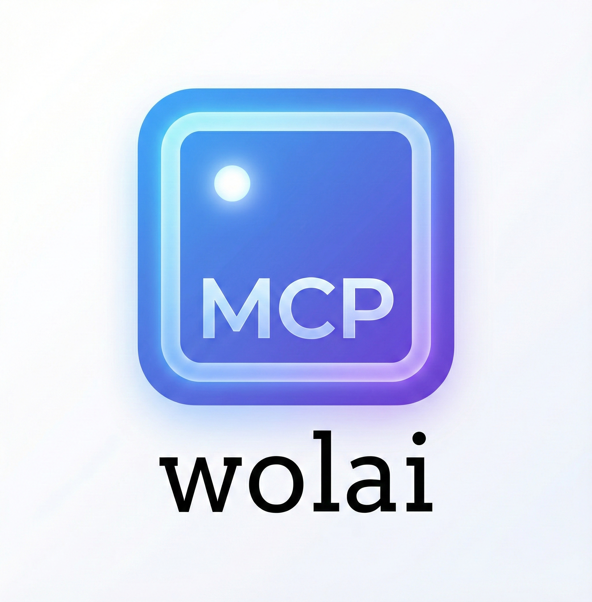

<p align="center">
  
</p>

# Wolai MCP Server 🐺

**English** | [中文](README_CN.md)

[](https://pypi.org/project/wolai-mcp/)
[](https://opensource.org/licenses/MIT)
[](https://afdian.com/a/LittlePeter52012)

**Connect AI agents to your [Wolai](https://www.wolai.com) knowledge base** via the Model Context Protocol (MCP).

Read, write, search, and navigate your Wolai pages — all from Claude, Gemini, Cursor, or any MCP-compatible AI agent.

---

## ✨ Features

| Category | Tools                                                                       | Description                                   |
| -------- | --------------------------------------------------------------------------- | --------------------------------------------- |
| 📖 Read   | `get_page_content`, `list_child_blocks`, `get_root_info`, `get_breadcrumbs` | Read pages, list children, navigate hierarchy |
| 🔍 Search | `search_pages_by_title`                                                     | Fuzzy title search across page tree           |
| ✏️ Write  | `create_page`, `add_block`, `add_code_block`                                | Create pages, append text/lists/headings/code |
| ⚙️ Config | `set_wolai_credentials`, `set_root_page`, `get_wolai_config`                | Runtime credential & root page management     |

**11 tools total** — covering read, write, search, and configuration.

---

## 🚀 Quick Start

### Install

### Option A: Quick Run with `uvx` (Recommended)

No installation needed — runs in a temporary isolated environment:

```bash
uvx wolai-mcp
```

> Don't have `uv`? Install it: `curl -LsSf https://astral.sh/uv/install.sh | sh`

### Option B: Install with `pip`

```bash
pip install wolai-mcp
```

### Get Credentials

1. Go to [Wolai Developer Console](https://www.wolai.com/dev)
2. Create an application → get **App ID** and **App Secret**
3. Find the **Root Page ID** from your Wolai page URL

---

## 📋 Configuration

All credentials are passed via **environment variables** — no need to edit any code.

| Variable           | Description                          | Required                         |
| ------------------ | ------------------------------------ | -------------------------------- |
| `WOLAI_APP_ID`     | Wolai Application ID                 | ✅                                |
| `WOLAI_APP_SECRET` | Wolai Application Secret             | ✅                                |
| `WOLAI_ROOT_ID`    | Root page ID for your knowledge base | Optional (for search/navigation) |

---

## 🔧 Platform Configuration

### Claude Desktop

Add to `claude_desktop_config.json`:

<table><tr><th>uvx (recommended)</th><th>pip</th></tr><tr><td>

```json
{
  "mcpServers": {
    "wolai-kb": {
      "command": "uvx",
      "args": ["wolai-mcp"],
      "env": {
        "WOLAI_APP_ID": "your_app_id",
        "WOLAI_APP_SECRET": "your_secret",
        "WOLAI_ROOT_ID": "your_root_id"
      }
    }
  }
}
```

</td><td>

```json
{
  "mcpServers": {
    "wolai-kb": {
      "command": "wolai-mcp",
      "env": {
        "WOLAI_APP_ID": "your_app_id",
        "WOLAI_APP_SECRET": "your_secret",
        "WOLAI_ROOT_ID": "your_root_id"
      }
    }
  }
}
```

</td></tr></table>

### Gemini CLI

Add to `~/.gemini/settings.json`:

```json
{
  "mcpServers": {
    "wolai-kb": {
      "command": "wolai-mcp",
      "env": {
        "WOLAI_APP_ID": "your_app_id",
        "WOLAI_APP_SECRET": "your_secret",
        "WOLAI_ROOT_ID": "your_root_id"
      }
    }
  }
}
```

### Cursor / CherryStudio / Other MCP Clients

<table><tr><th>uvx</th><th>pip</th></tr><tr><td>

```json
{
  "wolai-kb": {
    "command": "uvx",
    "args": ["wolai-mcp"],
    "env": {
      "WOLAI_APP_ID": "your_app_id",
      "WOLAI_APP_SECRET": "your_secret",
      "WOLAI_ROOT_ID": "your_root_id"
    }
  }
}
```

</td><td>

```json
{
  "wolai-kb": {
    "command": "wolai-mcp",
    "env": {
      "WOLAI_APP_ID": "your_app_id",
      "WOLAI_APP_SECRET": "your_secret",
      "WOLAI_ROOT_ID": "your_root_id"
    }
  }
}
```

</td></tr></table>

---

## 💡 Usage Examples

Once configured, ask your AI agent:

- *"读取我 Wolai 知识库的首页内容"*
- *"搜索标题包含'项目计划'的页面"*
- *"在首页下创建一个新页面叫'会议纪要'"*
- *"往指定页面添加一段代码"*
- *"显示当前 Wolai 配置状态"*

---

## 🔐 Runtime Configuration

You can also change credentials at runtime without restarting:

- **`set_wolai_credentials`** — Switch Wolai account
- **`set_root_page`** — Change the root knowledge base page
- **`get_wolai_config`** — Check current configuration

---

## 💖 Support This Project

If you find **Wolai MCP** useful, consider buying me a coffee!
Your support keeps this project alive and growing ✨

<table>
<tr>
<td align="center" width="50%">

### ☕ 爱发电 (Afdian)

<a href="https://afdian.com/a/LittlePeter52012">
  
</a>

<sub>Supports Alipay & WeChat Pay</sub>

</td>
<td align="center" width="50%">

### 💎 Crypto (USDC / ERC-20)

<a href="https://littlepeter52012.github.io/wolai-mcp/donate.html">
  
</a>

<sub>Click to donate — supports MetaMask, SafePal & more</sub>

</td>
</tr>
</table>

> Every little bit helps — **thank you!** 🙏

---

## 📄 License

MIT License — see [LICENSE](LICENSE) for details.
